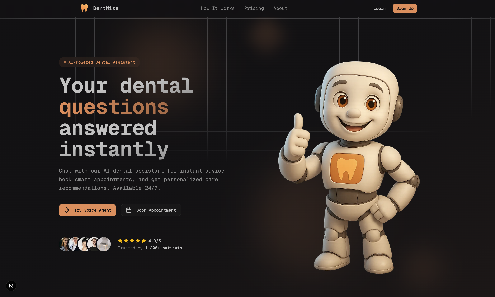
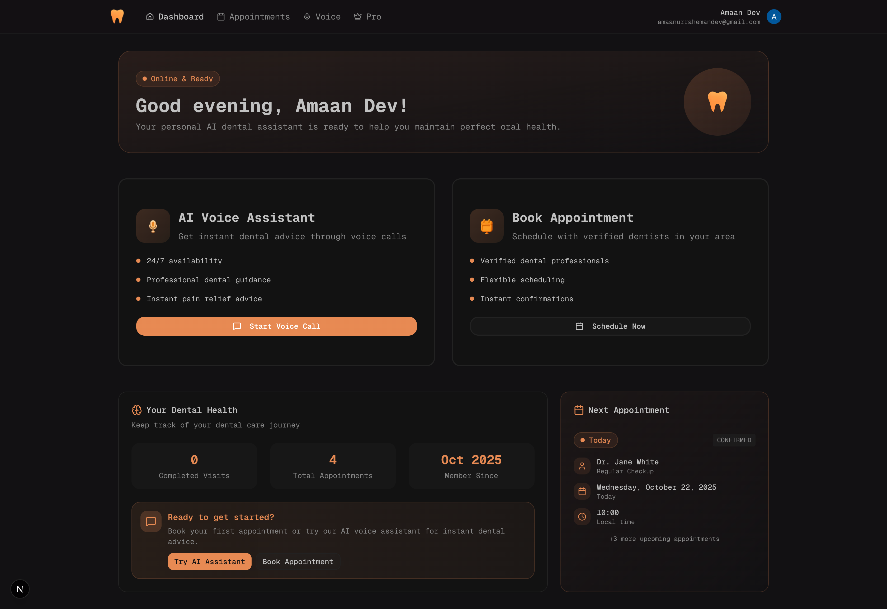
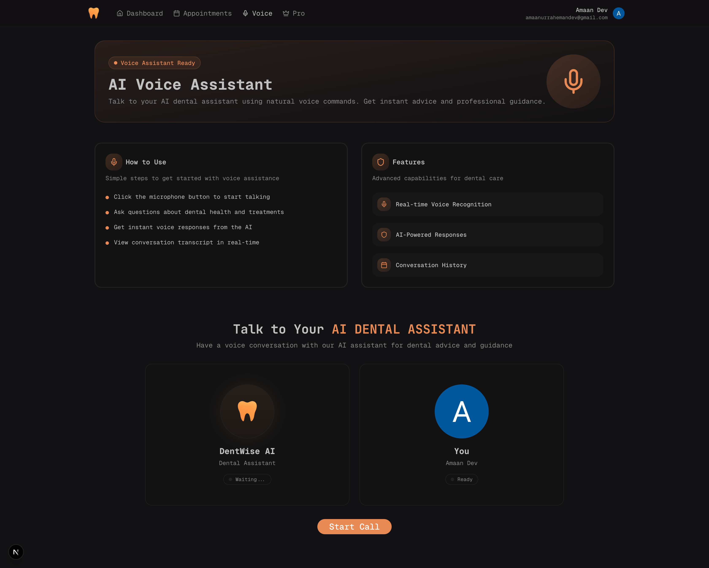
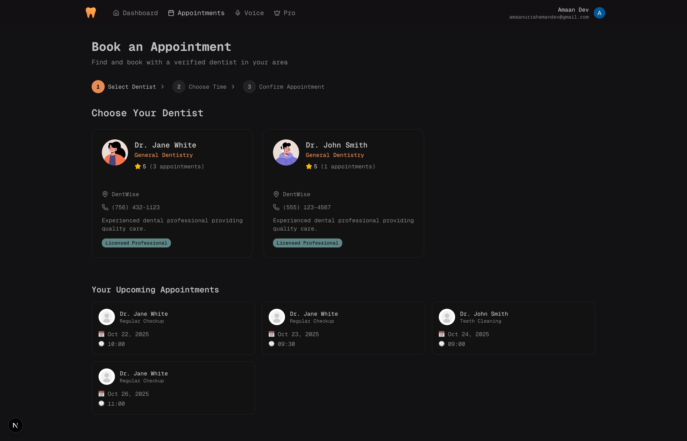
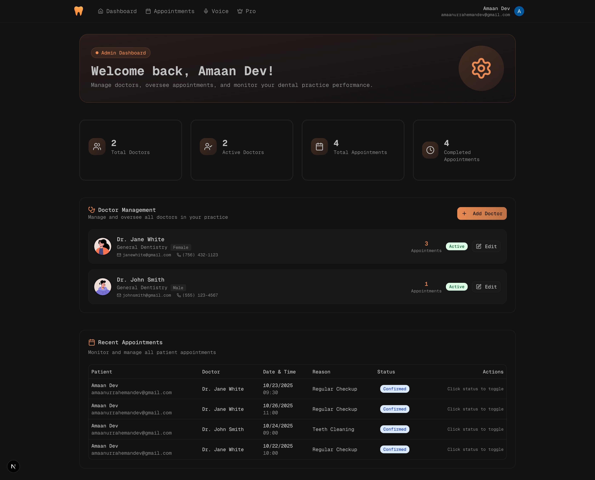
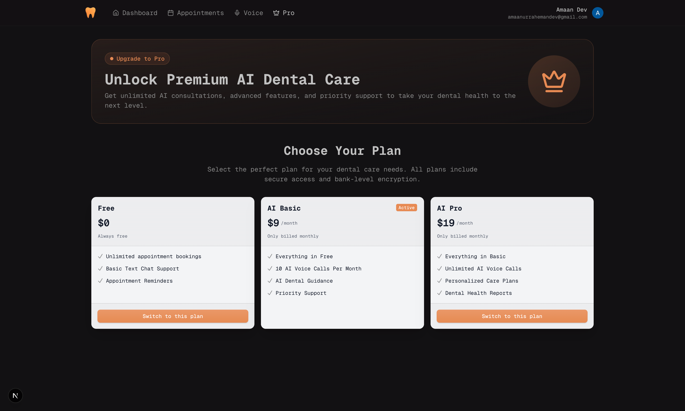

# 🦷 DentWise AI Dental Assistant

<div align="center">
  
  
  <p align="center">
    <strong>An intelligent dental assistant powered by AI voice technology</strong>
  </p>
  
  <p align="center">
    <a href="https://dentwise-ai-dental-assistan-p3h1i.sevalla.app" target="_blank">
      
    </a>
  </p>
  
  <p align="center">
    
    
    
    
    
  </p>
</div>

## 🌟 Overview

DentWise is a comprehensive AI-powered dental assistant that revolutionizes patient care through intelligent voice interactions, appointment management, and administrative tools. Built with modern web technologies, it provides seamless communication between patients and dental professionals.

## ✨ Features

### 🎤 AI Voice Assistant

- **Real-time voice interactions** with advanced AI
- **Natural language processing** for dental consultations
- **Intelligent responses** to dental health queries
- **Voice-to-text transcription** capabilities

### 📅 Appointment Management

- **Smart booking system** with doctor availability
- **Time slot conflict prevention**
- **Email notifications** for confirmations
- **Multi-step booking wizard**

### 👨‍⚕️ Doctor Management

- **Complete doctor profiles** with specializations
- **Availability scheduling**
- **Performance analytics**
- **Patient assignment system**

### 📊 Admin Dashboard

- **Real-time statistics** and analytics
- **Appointment overview** and management
- **Doctor performance metrics**
- **User management system**

### 💰 Pricing & Subscriptions

- **Flexible pricing tiers**
- **Pro subscription features**
- **Usage tracking**
- **Billing management**

## 🛠️ Tech Stack

### Frontend

- **Next.js 15** - React framework with App Router
- **TypeScript** - Type-safe development
- **Tailwind CSS** - Utility-first styling
- **Shadcn UI** - Accessible component library
- **React Hook Form** - Form management
- **Tanstack Query** - Data fetching and caching

### Backend & Database

- **Prisma ORM** - Database toolkit
- **PostgreSQL** - Primary database
- **Clerk** - Authentication and user management
- **Resend** - Email delivery service

### AI & Voice

- **Vapi AI** - Voice AI integration
- **React Email** - Email template system

### Development Tools

- **Biome** - Linting and formatting
- **Turbopack** - Fast bundler
- **TypeScript** - Static type checking

## 🚀 Getting Started

### Prerequisites

- Node.js 18+
- PostgreSQL database
- Clerk account for authentication
- Vapi AI account for voice features

### Installation

1. **Clone the repository**

    ```bash
    git clone https://github.com/amaan-ur-raheman/dentwise-ai-dental-assistant.git
    cd dentwise-ai-dental-assistant
    ```

2. **Install dependencies**

    ```bash
    npm install
    ```

3. **Set up environment variables**

    ```bash
    cp .env.example .env
    ```

    Configure the following variables:

    ```env
    DATABASE_URL="your_postgresql_url"
    NEXT_PUBLIC_CLERK_PUBLISHABLE_KEY="your_clerk_key"
    CLERK_SECRET_KEY="your_clerk_secret"
    NEXT_PUBLIC_VAPI_PUBLIC_KEY="your_vapi_key"
    RESEND_API_KEY="your_resend_key"
    ```

4. **Set up the database**

    ```bash
    npx prisma generate
    npx prisma db push
    ```

5. **Run the development server**

    ```bash
    npm run dev
    ```

6. **Open your browser**
   Navigate to [http://localhost:3000](http://localhost:3000)

## 📸 Screenshots

### 🏠 Landing Page


### 📊 Dashboard



### 🎤 AI Voice Assistant



### 📅 Appointments



### ⚙️ Admin Panel



### 💰 Pricing



## 📁 Project Structure

```
dentwise-ai-dental-assistant/
├── src/
│   ├── app/                    # Next.js App Router
│   │   ├── admin/             # Admin dashboard
│   │   ├── appointments/      # Appointment booking
│   │   ├── dashboard/         # User dashboard
│   │   ├── voice/            # Voice assistant
│   │   └── api/              # API routes
│   ├── components/            # React components
│   │   ├── ui/               # Reusable UI components
│   │   ├── admin/            # Admin-specific components
│   │   ├── appointments/     # Appointment components
│   │   ├── dashboard/        # Dashboard components
│   │   ├── landing/          # Landing page components
│   │   └── voice/            # Voice assistant components
│   ├── hooks/                # Custom React hooks
│   ├── lib/                  # Utility functions
│   └── types/                # TypeScript definitions
├── prisma/                   # Database schema
├── public/                   # Static assets
└── README.md
```

## 🔧 Available Scripts

- `npm run dev` - Start development server with Turbopack
- `npm run build` - Build for production
- `npm run start` - Start production server
- `npm run lint` - Run Biome linter
- `npm run format` - Format code with Biome

## 🚀 Deployment

### Vercel (Recommended)

1. Push your code to GitHub
2. Connect your repository to Vercel
3. Configure environment variables
4. Deploy automatically

### Manual Deployment

1. Build the application:
    ```bash
    npm run build
    ```
2. Start the production server:
    ```bash
    npm run start
    ```

## 🤝 Contributing

1. Fork the repository
2. Create a feature branch: `git checkout -b feature/amazing-feature`
3. Commit your changes: `git commit -m 'Add amazing feature'`
4. Push to the branch: `git push origin feature/amazing-feature`
5. Open a Pull Request

## 📄 License

This project is licensed under the MIT License - see the [LICENSE](LICENSE) file for details.

## 👨‍💻 Author

**Amaan Ur Raheman**

- GitHub: [@amaan-ur-raheman](https://github.com/amaan-ur-raheman)

## 🙏 Acknowledgments

- [Next.js](https://nextjs.org/) for the amazing React framework
- [Clerk](https://clerk.com/) for authentication services
- [Vapi AI](https://vapi.ai/) for voice AI capabilities
- [Shadcn UI](https://ui.shadcn.com/) for accessible components
- [Tailwind CSS](https://tailwindcss.com/) for styling

---

<div align="center">
  <p>Made with ❤️ for better dental care</p>
</div>
